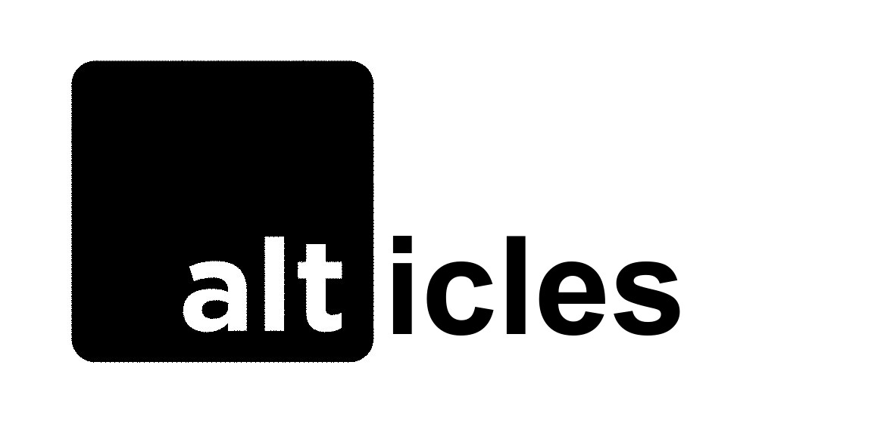

# Alticles

**Live link: https://odd-cyan-viper-cuff.cyclic.app/**

Alticles is a full-stack blogging web app, an extension of the blogging API ([Altblog](https://github.com/2bit2bit/Altblog)) I recently build.

Alticles allows logged-in users to create edit delete publish unpublish articles they made and both logged-in and not logged in users can view all articles 

Other features include adding a cover photo to the article, password reset etc

It is built with Node.js, Express.js, MongoDB
## Installation

Fork and Clone this repo

1. Go to the project directory and run 
    ```bash
    npm install
    ```
    to instal dependencies

2. Add environment variables
   
   - PORT
   - MONGODB_UR
   - SESSION_SECRET
   - SENDGRID_API_KEY
   - MAIL_USERNAME
   - MAIL_PASSWORD
   - CLOUD_NAME
   - CLOUDINARY_API_KEY
   - CLOUDINARY_API_SECRET
   - CLOUDINARY_URL
   - PAYSTACK_MySecretKey
  
3. Start the app
    ```bash
    npm start
    ```
4. Vsit the URL from your browser


## Contributing
Pull requests are welcome.

## License

[MIT](https://choosealicense.com/licenses/mit/)