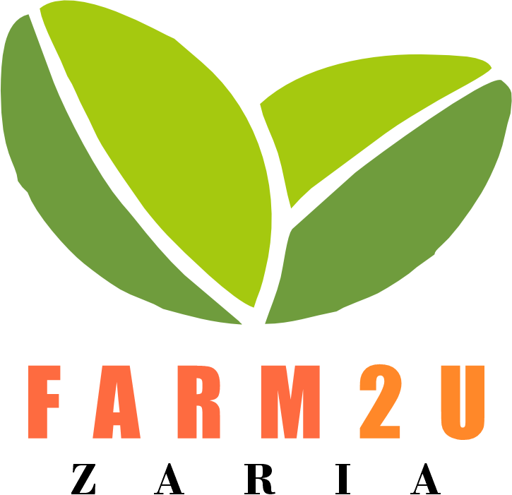

#Farm2U Zaria



Farm2U is a full-stack web app, design to help farmers sell their produce directly to consumers. It is built with Node.js, Express.js, MongoDB, and EJS. It allows farmers to create, edit, delete, publish, and unpublish articles they made. Both logged-in and not logged-in users can view all articles. Other features include adding a cover photo to the article, password reset, etc.

It is a project for Software Engineering III course at Ahmadu Bello University, Zaria.

## Installation

Fork and Clone this repo

1. Go to the project directory and run 
    ```bash
    npm install
    ```
    to instal dependencies

2. Add environment variables
   
   - PORT
   - MONGODB_URI
   - SESSION_SECRET
   - CLOUD_NAME
   - CLOUDINARY_API_KEY
   - CLOUDINARY_API_SECRET
   - CLOUDINARY_URL
 
  
3. Start the app
    ```bash
    npm start
    ```
4. Vsit the URL from your browser

## License

[MIT](https://choosealicense.com/licenses/mit/)